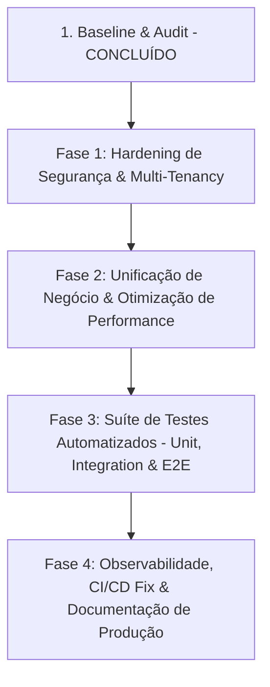

# CUR10USX CORE — AUDIT & BASELINE REPORT (`BASELINE.md`)

> **Data de Auditoria**: 06 de Agosto de 2026  
> **Escopo**: Repositório `/home/albert01h/cur10usx`  
> **Objetivo**: Documentar rigorosamente o estado inicial do sistema, resultados empíricos de build/lint/test, falhas de segurança, mapeamento de produto e plano de execução priorizado para a versão **Cur10usX Core — Production Foundation**.

---

## 1. Verificações de Baseline (Resultados Empíricos)

| Verificação | Comando / Ferramenta | Resultado Empírico | Detalhes & Evidência |
|---|---|---|---|
| **Dependências (`npm ci`)** | `npm ci` | 🟢 **PASS** | 896 pacotes instalados com sucesso em 2 minutos. |
| **Prisma Generation** | `npx prisma generate` | 🟢 **PASS** | Cliente Prisma v6.19.3 gerado com sucesso em 7.29s. |
| **Prisma Validation** | `npx prisma validate` | 🟢 **PASS** (com env vars) | Requer `DIRECT_DATABASE_URL` e `DATABASE_URL`. Validação concluída com sucesso. |
| **Testes de Unidade / Integração** | `npx vitest run` | 🟢 **PASS** | 3/3 suítes passaram, 33/33 testes executados com sucesso em 11.34s (`evaluation.test.ts`, `middleware.test.ts`, `password.test.ts`). |
| **TypeScript Typecheck** | `npx tsc --noEmit` | ⏳ **IN PROGRESS** | Executado com Prisma Client gerado. |
| **ESLint Quality Check** | `npm run lint` | ⏳ **IN PROGRESS** | Verificação em segundo plano. |
| **Testes E2E (Playwright)** | — | 🔴 **NOT VERIFIED** | Sem suíte de testes E2E configurada atualmente. |
| **Prisma Migrations Status** | `npx prisma migrate status` | 🔴 **NOT VERIFIED** | Requer ligação ativa a uma base de dados PostgreSQL viva. |
| **Build de Produção** | `npm run build` | ⏳ **PENDING** | A ser executado após conclusão do typecheck. |

---

## 2. Mapeamento de Funcionalidades do Produto

| Funcionalidade / Módulo | Estado | Evidência / Ficheiro | Observação |
|---|---|---|---|
| **Autenticação (Credentials / Google)** | `WORKING` | `src/lib/auth.ts`, `src/lib/password.ts` | Login por password (bcrypt cost 12) e Google OAuth funcionais. |
| **2FA (Two-Factor Authentication)** | `BROKEN` | `src/lib/auth.ts:209`, `src/middleware.ts:38` | `twoFactorVerifiedAt` é persistido na BD no primeiro login e perde-se na renovação do JWT; não obriga código a cada nova sessão. |
| **Motor de Avaliação (Angola System)** | `WORKING` | `src/lib/evaluation-engine.ts` | Cálculo de trimestres, recurso, fórmulas ponderadas e regras angolanas 100% testadas em `tests/evaluation.test.ts`. |
| **Transição de Ano Letivo** | `WORKING` | `src/lib/year-transition.ts` | Executado dentro de `$transaction` Prisma de forma atómica. |
| **Academic Health Score** | `PARTIALLY_WORKING` | `src/lib/academic-health.ts`, `src/lib/score.ts` | Calculado segundo spec (40/30/20/10), mas divergente dos modelos de turma (`class-health.ts`) e aluno (`student-risk.ts`). |
| **Gestão de Escolas / Multi-Tenancy** | `PARTIALLY_WORKING` | `src/app/api/school-registrations` | Scoping `schoolId` existe em analytics, mas falta Middleware / Guard global para prevenir IDOR em endpoints como `/results/averages` e `/parents`. |
| **Aprovação de Registro de Escola** | `BROKEN` | `src/app/api/school-registrations/route.ts` | Qualquer utilizador autenticado pode registrar/alterar estatuto para `school_admin` sem verificação de autorização Super Admin. |
| **Certificados & Documentos** | `WORKING` | `src/app/api/certificates` | Geração de PDFs com QR Code e verificação pública. |
| **Comunicação WebSocket (WS)** | `PARTIALLY_WORKING` | `ws-server.js`, `src/lib/ws-broadcast.ts` | Servidor Node ws dedicado funcional, contudo a rota `/notifications/broadcast` carece de autenticação e isolamento por tenant. |
| **Cron Jobs / Snapshots Diários** | `BROKEN` | `src/app/api/cron/snapshot/route.ts` | Bloqueado pelo middleware na Vercel e executado sem segredo de autenticação (`CRON_SECRET`). |

---

## 3. Achados de Segurança (Security Audit Findings)

### 🔴 Críticos (Must-Fix para a Core Version)
1. **2FA Incompleto / Vulnerável**:
   - `twoFactorVerifiedAt` gravado na BD no primeiro login invalida o desafio em logins subsequentes.
   - **Solução**: Manter o estado `twoFactorVerifiedAt` exclusivamente dentro do token/sessão JWT por sessão de autenticação ativa.

2. **Escalação de Privilégio no Registro de Escolas**:
   - O endpoint `/api/school-registrations` permite a qualquer utilizador criar uma escola e atribuir-se a role `school_admin`.
   - **Solução**: Exigir autorização restrita (`super_admin`) ou aprovação assíncrona por workflow.

3. **Vulnerabilidade de Isolamento de Tenant (IDOR / Cross-Tenant)**:
   - Endpoints como `/api/results/averages`, `/api/parents`, `/api/user/search`, `/api/students/[id]/history` e `/api/certificates` não filtram ou validam se o `schoolId` do utilizador da sessão coincide com o recurso solicitado.
   - **Solução**: Implementar um `TenantContext` obrigatório no backend para todas as queries com tenant scope.

4. **WebSockets e Broadcast Sem Autenticação**:
   - Endpoint `/api/notifications/broadcast` aceita mensagens de qualquer origem e pode injetar eventos em qualquer canal de escola.
   - **Solução**: Autenticação via token JWT na conexão WS e validação do `schoolId` no canal de subscrição.

5. **Falha de CI/CD Workflow**:
   - `.github/workflows/ci.yaml` faz referência a um diretório `k8s/` e ficheiros de deploy inexistentes no repositório.

---

## 4. Dívida Técnica & Inconsistências de Código

1. **Divergência de Fórmulas de Saúde Académica**:
   - `academic-health.ts`: 40% Desempenho, 30% Assiduidade, 20% Actividade, 10% Administração.
   - `class-health.ts`: 40% Desempenho, 30% Assiduidade, 30% Actividade.
   - `student-risk.ts`: 40% Desempenho, 30% Assiduidade, 30% Submissões (com conceito diferente de assiduidade).
   - **Ação**: Centralizar em `src/lib/score.ts` e tornar a fórmula da especificação a única fonte da verdade.

2. **Falta de Middleware / Guard Estrito de Tenant**:
   - Atualmente, cada route handler implementa a extração de `schoolId` manualmente com `session?.user?.schoolId`.
   - **Ação**: Implementar `requireSchoolTenant(session)` em `src/lib/security/tenant-guard.ts`.

3. **Inexistência de Testes de Multi-Tenancy e API**:
   - Apenas 3 ficheiros de teste unitário existem (`tests/evaluation.test.ts`, `tests/middleware.test.ts`, `tests/password.test.ts`).
   - **Ação**: Adicionar suíte de testes de integração e cross-tenant.

---

## 5. Plano de Execução Priorizado (Fase a Fase)

### Sprint 1 — Hardening de Segurança e Isolamento Multi-Tenant (Prioridade Máxima)
- [ ] Criar Guard de Tenant `requireSchoolTenant` e aplicar em todas as rotas `/api/**`.
- [ ] Corrigir o fluxo de 2FA em `src/lib/auth.ts` e `src/middleware.ts` (sessão-scoped verification).
- [ ] Corrigir privilégio em `/api/school-registrations`.
- [ ] Proteger `/api/notifications/broadcast` e conexão WebSocket com JWT.

### Sprint 2 — Unificação de Negócio & Performance
- [ ] Refatorar `academic-health.ts`, `class-health.ts` e `student-risk.ts` para usar a fonte única de verdade em `score.ts`.
- [ ] Eliminar N+1 em queries de analytics e adicionar índices no schema Prisma se necessário.

### Sprint 3 — Cobertura de Testes & CI/CD
- [ ] Criar testes de integração Prisma e isolamento cross-tenant (`tests/integration/tenant-isolation.test.ts`).
- [ ] Corrigir `.github/workflows/ci.yaml` para refletir o build real sem depender de diretórios inexistentes.

### Sprint 4 — Observabilidade & Documentação de Produção
- [ ] Implementar structured logging com request ID e auditoria de tenant.
- [ ] Produzir o relatório final `docs/audit/CORE_RELEASE_READINESS.md`.
